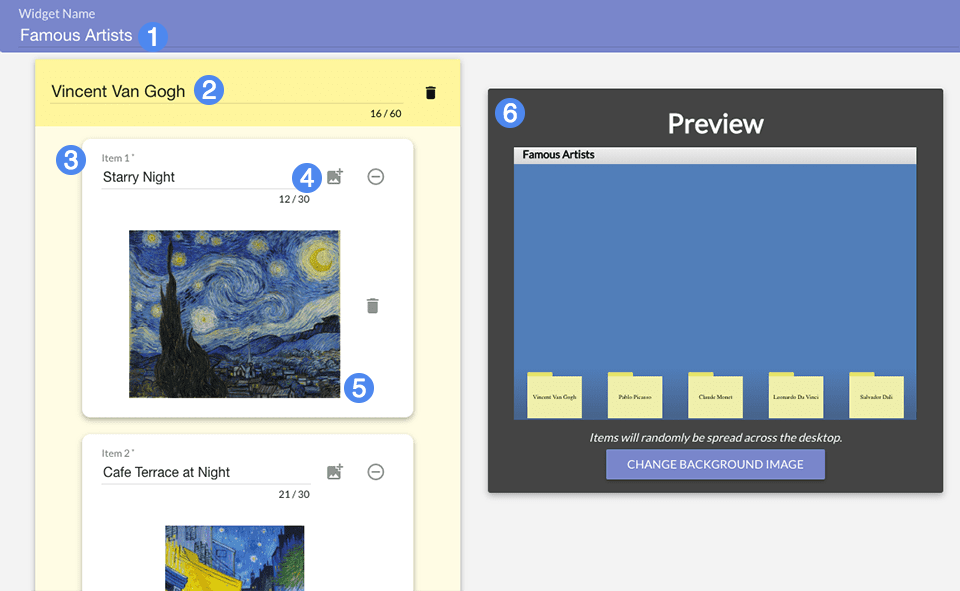

## Overview ##

Sort It Out! tasks students with sorting a pile of items into their respective categories. The widget is thematically inspired by sorting icons into folders on a messy computer desktop.

1. Title of the widget
2. Set title of this folder
3. Create item within this folder
4. Add an image to this folder
5. Image currently added to this folder
6. Folder preview

## Details ##

The left-hand section of the creator allows you to create categorical folders and the individual items that should be sorted into that folder. Folders are required to have a name (2). Each item within the folder can be comprised of text, an image, or both. When creating your widget, make sure the association between a folder and the items it contains is contextually clear and relevant.

You can create up to five folders, but there is no limit to the number of items each folder can contain.
