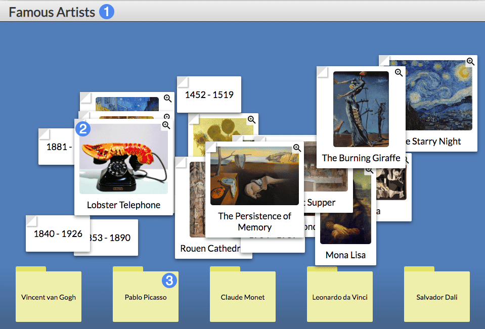
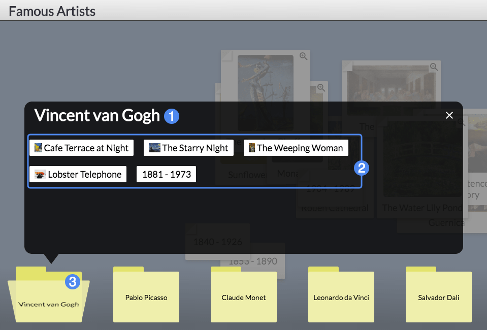

# Player Guide #

## Overview ##

Sort It Out! tasks students with sorting a pile of items into their respective categories. The widget is thematically inspired by sorting icons into folders on a messy computer desktop.

1. Title of the widget
2. An individual item to be sorted, amidst a pile of other items
3. Folders into which the items should be sorted

## Details ##

Sort It Out! requires students to place each item on the desktop into one of the folders along the bottom, based on the most contextually relevant category. Click and drag each item over the folder it should be placed in, then let go to place the item in the folder. When all the items are categorized into a folder, the student is asked to submit the widget for scoring.

1. Folder Title
2. Items currently placed in the folder
3. Currently opened folder

### Moving Items Into and Out of Folders ###

Students can move items between folders at any time. To do so, click the folder to open it up and review the items inside. Items can be dragged either outside of the dialog box, placing them back on the unsorted "desktop", or into another folder. Close the folder by clicking on the folder again, or pressing the "X" on the top-right of the folder view.
